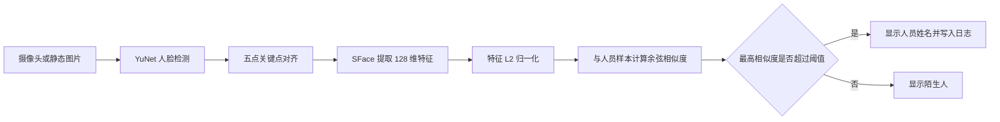

# FaceVision：基于 Qt 与 OpenCV 的人脸识别系统

FaceVision 是一个使用 **C++17、Qt 6、OpenCV 和 SQLite** 开发的桌面人脸识别应用。系统支持从摄像头视频流或本地静态图片中检测人脸，提取 SFace 人脸特征，并与已注册人员的多个人脸样本进行相似度比较。同时提供人员管理、样本管理、识别日志和抓拍查看功能。

本项目为计算机科学与技术专业编程实战课程个人项目。

## 功能特性

- 摄像头实时画面采集、启动与停止
- PNG、JPG、JPEG、BMP 静态图片导入
- 基于 YuNet 的多人脸检测与五点关键点定位
- 基于 SFace 的人脸对齐和 128 维特征提取
- 使用余弦相似度进行身份匹配和陌生人判定
- 人员信息的新增、修改、删除和搜索
- 支持为同一人员保存多张不同角度的人脸样本
- 人脸样本缩略图查看、批量增加和单独删除
- 摄像头识别日志防重复记录
- 识别时间、姓名、相似度、来源和抓拍持久化
- 双击日志查看识别抓拍，一键清空日志
- SQLite 数据库存储与历史数据库自动升级
- 简约的圆角卡片式界面、悬停反馈和柔和阴影
- 自动化检测、特征和数据库回归测试

## 界面与操作流程

主界面由三个区域组成：

1. **实时预览**：显示摄像头画面或导入的静态图片，并绘制人脸框、姓名和相似度。
2. **快捷操作**：启动摄像头、导入图片、注册人脸和进入人员管理。
3. **识别记录**：显示最近 200 条识别事件，双击记录可查看抓拍。

典型操作流程：

```text
启动摄像头或导入图片
        ↓
检测并框出人脸
        ↓
点击“注册人脸”录入人员
        ↓
再次输入该人员的其他照片或摄像头画面
        ↓
系统显示姓名、相似度并保存识别日志
```

## 技术路线



### 人脸检测

项目使用 OpenCV `FaceDetectorYN` 加载 YuNet 模型。为兼顾超大图片、近距离人脸和侧脸，检测采用三轮回退策略：

| 轮次 | 最大检测尺寸 | 置信度阈值 | 主要用途 |
|---|---:|---:|---|
| 1 | 1280 | 0.90 | 常规图片和摄像头画面 |
| 2 | 640 | 0.90 | 人脸占画面比例很大的近距离图片 |
| 3 | 1280 | 0.85 | 侧脸及较困难样本 |

检测成功后，会将缩放图片中的矩形框和五个关键点还原到原图坐标。

### 人脸特征提取

项目使用 OpenCV `FaceRecognizerSF` 加载 SFace 模型。系统根据双眼、鼻尖和两个嘴角将人脸旋转、缩放到标准姿态，再提取 128 维浮点特征向量。特征经过 L2 归一化后存入数据库。

### 身份匹配

当前人脸特征会与数据库中每个人的所有样本逐一计算余弦相似度：

```text
cosine(A, B) = (A · B) / (||A|| × ||B||)
```

程序选择最高相似度对应的人员。当最高相似度低于 `0.363` 时，结果显示为“陌生人”。该阈值位于 `mainwindow.h`，可以根据测试数据进一步校准。

## 数据库设计

程序首次启动时自动创建 `faces.db`，包含三张主要数据表：

### `people`

保存人员编号、姓名、部门和创建时间。

### `face_samples`

保存人员的人脸特征、样本缩略图路径和模型版本。一个人员可以对应多个人脸样本。

### `recognition_logs`

保存识别时间、人员、识别时姓名、相似度、输入来源和抓拍路径。即使人员后来被删除，历史日志仍保留识别时的姓名。

```text
people 1 ───── N face_samples
people 1 ───── N recognition_logs
```

图片文件不直接写入 SQLite，而是保存在程序目录下：

```text
face_samples/              已注册人员的对齐人脸缩略图
recognition_snapshots/     识别日志抓拍
```

## 项目结构

```text
FaceRecognition6666/
├─ CMakeLists.txt                  CMake 构建配置
├─ main.cpp                       程序入口
├─ mainwindow.h/.cpp/.ui          主窗口、摄像头、识别、注册和日志
├─ facerecognizer.h/.cpp          YuNet 检测和 SFace 特征提取
├─ facedatabase.h/.cpp            SQLite 数据库访问
├─ personmanagerdialog.h/.cpp     人员和人脸样本管理
├─ facesamplestorage.h/.cpp       样本图片存储
├─ recognitionlogstorage.h/.cpp  识别抓拍存储
├─ models/                        YuNet 与 SFace ONNX 模型
├─ images/                        可选的本地测试图片（程序不依赖）
└─ tests/                         自动化测试程序
```

## 开发环境

本项目当前开发和验证环境：

- Windows 11 64 位
- Qt 6.11.1，MSVC 2022 64-bit Kit
- CMake 3.16
- Visual Studio 2022 / MSVC
- OpenCV 4.10.0
- C++17

Qt 需要以下模块：

```text
Core
Gui
Widgets
Sql
```

模型文件：

```text
models/face_detection_yunet_2023mar.onnx
models/face_recognition_sface_2021dec.onnx
```

## 配置与编译

### 使用 Qt Creator

1. 安装 Qt 6.11.1，并选择 MSVC 2022 64-bit 组件。
2. 安装 OpenCV 4.10.0。
3. 使用 Qt Creator 打开根目录的 `CMakeLists.txt`。
4. 选择 `Desktop Qt 6.11.1 MSVC2022 64bit` Kit。
5. 在项目的 CMake 配置中设置本机 `OpenCV_DIR`，例如 OpenCV 安装目录下的 `build/x64/vc16/lib`。
6. 选择 Release 或 Debug 配置并构建项目。
7. 运行 `FaceRecognition6666`。

项目源码中不包含开发者电脑的OpenCV绝对路径。不同电脑通过CMake缓存或Qt Creator配置自己的路径，无需修改 `CMakeLists.txt`。

### 使用命令行

以下命令中的 Qt 路径和生成器需要根据本机环境调整：

```powershell
cmake -S . -B build -G "Visual Studio 17 2022" -A x64 `
  -DCMAKE_PREFIX_PATH="D:/Qt/6.11.1/msvc2022_64" `
  -DOpenCV_DIR="D:/OpenCV/build/x64/vc16/lib"
cmake --build build --config Release --parallel 4
```

对于非标准OpenCV目录结构，还可以增加：

```powershell
-DOpenCV_RUNTIME_DIR="D:/OpenCV/build/x64/vc16/bin"
```

Release 可执行程序位于：

```text
build/Release/FaceRecognition6666.exe
```

CMake 会在构建后自动把模型目录和 OpenCV DLL 复制到可执行程序目录。

## 使用说明

### 摄像头识别

1. 点击“启动摄像头”。
2. 面向摄像头并保持光线充足。
3. 系统会在人脸旁显示姓名或“Stranger”以及相似度。
4. 点击“停止摄像头”结束采集。

同一个人持续停留在画面中时只记录一次日志；离开后重新进入，并超过 5 秒冷却时间，才会再次记录。

### 静态图片识别

1. 点击“导入图片”。
2. 选择一张 PNG、JPG、JPEG 或 BMP 图片。
3. 系统检测图片中的所有人脸，并显示识别结果。

项目通过 `QFile + cv::imdecode` 读取图片，可正确处理包含中文的 Windows 文件路径。

### 注册人员

1. 启动摄像头或导入包含一张人脸的图片。
2. 点击“注册人脸”。
3. 输入人员编号、姓名和部门。
4. 如果人员编号已经存在，可将当前人脸追加为该人员的新样本。

注册图片必须恰好检测到一张人脸，避免把错误人员的特征写入数据库。

### 管理人员和样本

点击“人员管理”后可以：

- 按编号、姓名或部门搜索人员；
- 新增、修改或删除人员；
- 查看一个人的所有人脸样本；
- 一次选择多张图片增加样本；
- 删除质量较差或录入错误的样本。

### 查看识别日志

- 右侧列表显示最近 200 条识别记录；
- 双击记录查看识别时的抓拍；
- 点击“清空记录”删除数据库日志及对应抓拍文件。

## 自动化测试

构建项目后运行：

```powershell
ctest --test-dir build -C Release --output-on-failure
```

默认测试不依赖 `images` 目录，覆盖：

- 人员数据库增删改查
- 同一人员多样本注册
- 人脸样本图片清理
- 识别日志保存、人员删除后的历史保留和抓拍清理

需要使用自备人脸图片进行检测和特征回归测试时，可以显式开启：

```powershell
cmake -S . -B build `
  -DENABLE_FACE_IMAGE_TESTS=ON `
  -DFACE_TEST_IMAGES="D:/test/face1.png;D:/test/face2.jpg"
```

可选图片测试覆盖：

- 常规单人人脸检测
- 超大尺寸图片检测
- 正脸、近距离人脸和侧脸回归检测
- 人脸对齐及 128 维特征提取

开发过程中曾使用11项测试验证常规人脸、超大图片、近距离人脸、正脸和侧脸；这些测试图片不是正式程序依赖。

## 设计要点

- **职责分离**：主窗口负责调度，算法、数据库和文件存储分别封装。
- **一致的人脸处理流程**：注册和识别都经过同一套检测、对齐、特征提取和归一化过程。
- **多样本识别**：当前人脸与同一人员的全部样本比较，选择最高相似度。
- **内存缓存**：人员特征加载到内存，避免每帧重复查询 SQLite。
- **事务注册**：创建人员和保存首个人脸样本作为一个数据库事务执行。
- **事件式日志**：记录“人员进入画面”，而不是为摄像头每一帧写日志。
- **安全文件清理**：删除前检查目标文件是否位于程序管理的存储目录中。

## 已知限制与改进方向

- 当前没有活体检测，无法防御照片或视频攻击。
- 摄像头识别在主线程执行；更复杂模型可能需要使用工作线程。
- 当前没有独立的人脸跟踪器，框的稳定性依赖逐帧检测结果。
- 相似度阈值来自模型建议和当前样本测试，仍可通过更大的验证集校准。
- 人员规模较小时采用线性比较；上万人规模可引入 FAISS 等近邻搜索方案。
- 当前项目没有账号、角色和管理员权限控制。

## 作者
### yqOffline

## 许可证与模型说明

本项目用于课程学习与技术研究。若后续公开发布或用于商业场景，应进一步核对 Qt、OpenCV、YuNet、SFace 以及所使用测试图片的许可证和授权范围。
